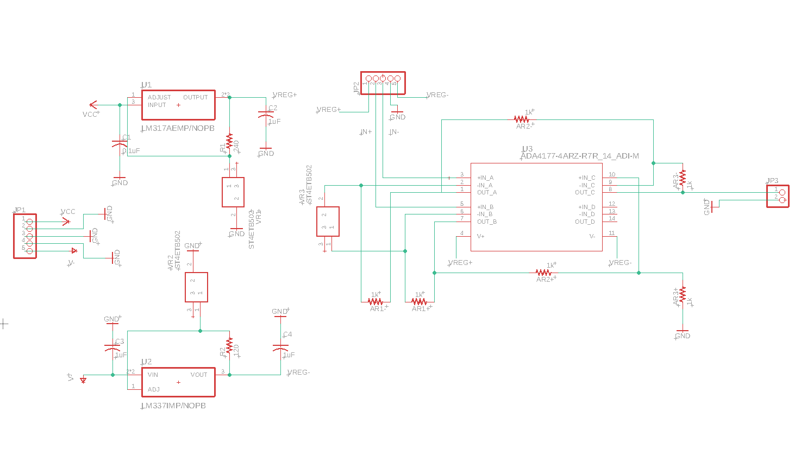
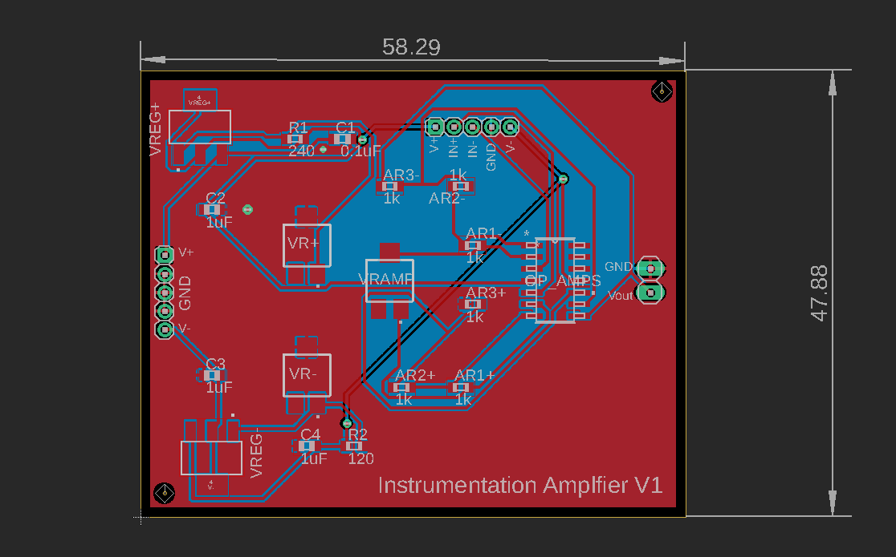

<h1>Instrumentation Amplifier with Regulated Dual Supply</h1>

The instrumentation amplifier uses an adjustable gain differential amplifier with buffered inputs to amplify the readings from an analog sensor using a wheatstone bridge such as a load cell or pressure transducer. The operational amplifiers use a dual power supply which is regulated using variable linear voltage regulators.

<b>Working Directory Structure:</b>

   doc: Documentation and data sheets
   
   src: source files, e.g. schematic and board files

   lib: libraries for schematic symbols and footprints

   production: files needed for PCB fabrication, e.g. gerbers, profile, drill file

   sim: simulation files 

   CAD: 3D CAD models
  
   img: Images of Circuit/Footprints for github display 

