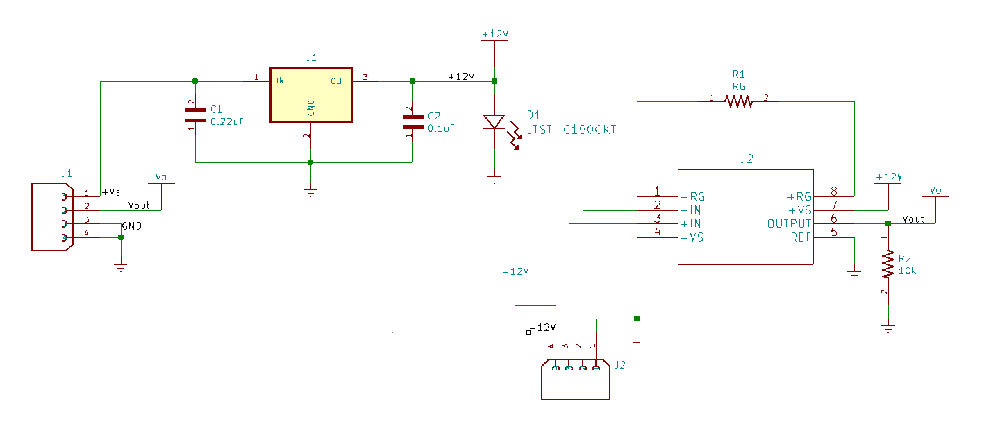
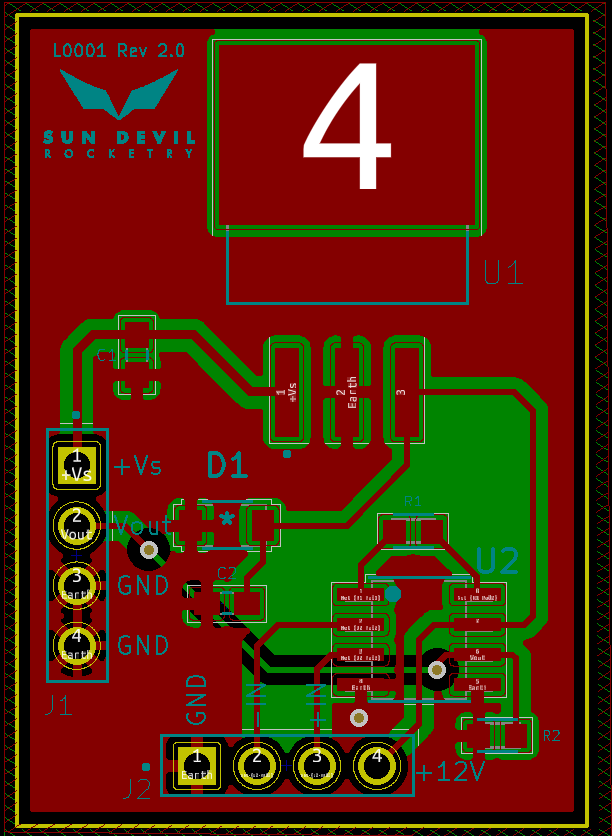
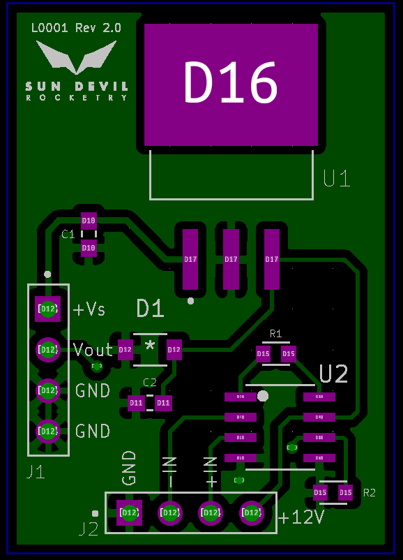
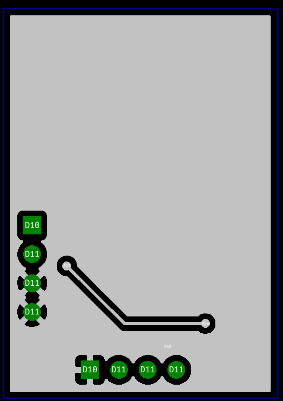

<h1>Rail to Rail Instrumentation Amplifier with Regulated Supply</h1>

<u>Current PCB Revision:</u> 2.0 

PCB Part Number: L0001

The instrumentation amplifier IC uses an adjustable gain differential amplifier with buffered inputs to amplify the readings from an analog sensor using a wheatstone bridge such as a load cell or pressure transducer. The amplifier supply voltage was chosen to match that of the pressure transducers it is intended to be used with.

<b>Working Directory Structure:</b>

   doc: Documentation
   
   src: source design files, e.g. schematic and board files

   lib: libraries for schematic symbols and footprints

   production: files needed for PCB fabrication, e.g. gerbers, profile, drill file

   sim: simulation files 

   CAD: 3D models
  
   img: Images of Circuit/Footprints for github display 

